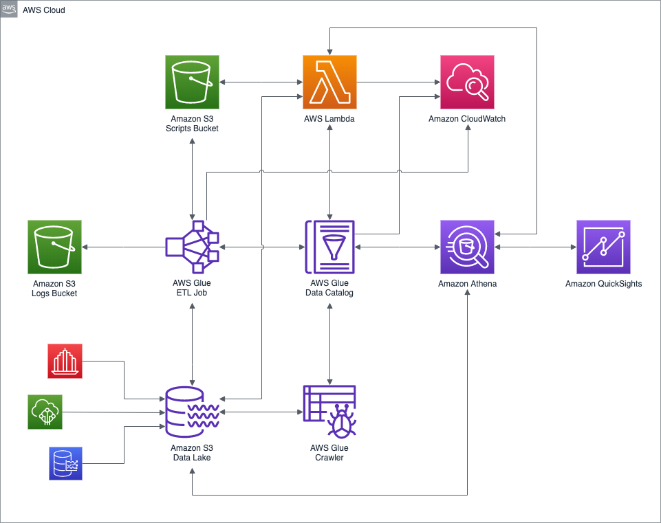

## Objective

Generate a set of event driven data pipelines to ingest data from xxxx and provide unified analtyics layer through Athena. 

### Process flow 

* Ingest data via lambda
* Event driven processing using SNS & SQS
* Preprocessing and transformation in Athena and Glue 
* Anlytics through Athena and Redshift & QuickSight
* Insights & recommendations through SageMaker 

## Requirements

## Providers

AWS

### Conceptual Model

### References 
* Terraform 
* Athena 
* Glue 
* Data Model
* Governance

